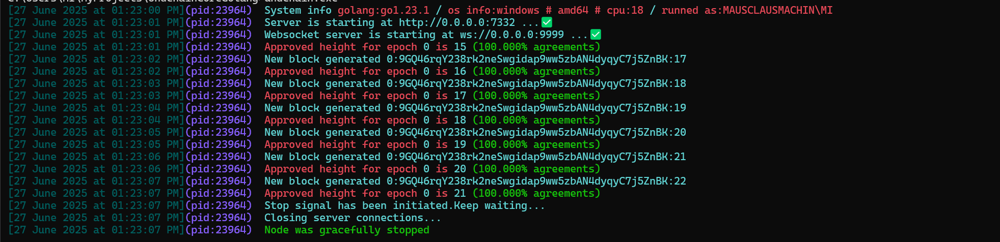

# Launch instructions

### 1. Build the core

```bash
# Unix
./build.sh

# Windows
build.bat
```

### 2. Create directory for chaindata

```sh
mkdir /path/to/chaindata

cd /path/to/chaindata
```

In this directory you should add `configs.json` and `genesis.json`. The chaindata (databases) also will be located here. The chaindata structure will be

```
├── configs.json
├── genesis.json
├── DATABASES/
│   ├── BLOCKS/
│   ├── EPOCH_DATA/
│   ├── APPROVEMENT_THREAD_METADATA/
│   └── FINALIZATION_VOTING_STATS/
└── ...
```

### 3. Prepare `configs.json` and `genesis.json`

Examples available in `templates` directory. For tests - just copy it to chaindata dir


### 4. Set the time when initial epoch should start

You have a script `time_update.py`

```python
import time

millis = int(time.time() * 1000)
print(millis)
```

This script prints the current Unix timestamp in milliseconds

```sh
1751019876494
```

Visit the `/path/to/chaindata/genesis.json` and modify line:

```json
"FIRST_EPOCH_START_TIMESTAMP":1751019876494,
```

### 4. Set the env variable

Now set the env variable - path to chaindata

```sh
export CHAINDATA_PATH = full/path/to/chaindata
```

> ⚠️ **Important** - the `CHAINDATA_PATH` must be a FULL path


### 5. Launch

In the same shell where you stored the env variable - run

```sh
./undchain
```

**This should run the local testnet with a single validator which generates blocks**




# Restarting network

This version may contains the bugs, so to restart the network you should:

1. Stop the node
2. Delete the `DATABASES` directory in `$CHAINDATA_PATH`
3. Update the `FIRST_EPOCH_START_TIMESTAMP` with a new value (just run the `time_update.py` again)
4. Run binary again